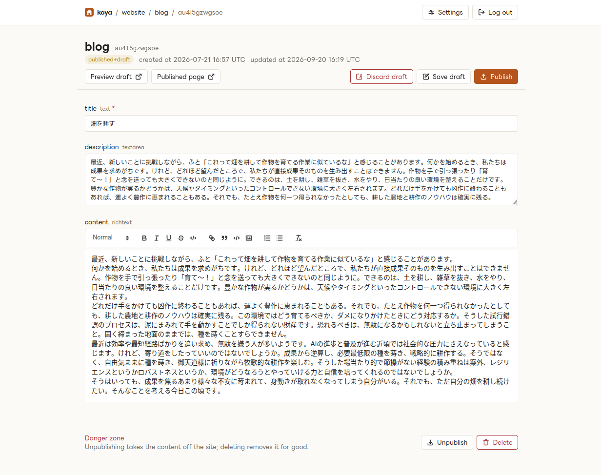
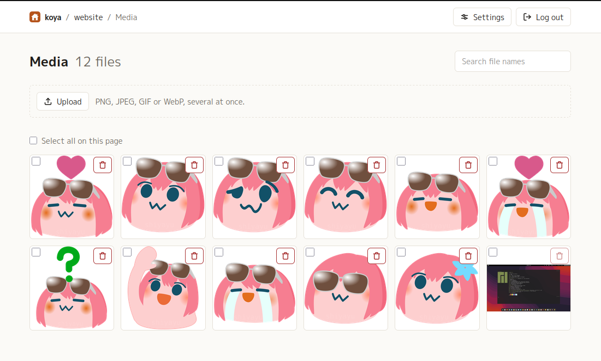

# koya

A small, self-hosted headless CMS written in Common Lisp, for one owner and any number of sites.

- **Server** (`koya-server`): admin UI, delivery API, admin API and media library. One process, one Docker image.
- **Library** (`koya`): a schema DSL (`defspace` / `defmodel` / `webhook`), `plan` / `deploy` / `pull` to push that schema to the server, and an HTTP client for reading and managing content.

The schema is code in the site's repository; the server stores a copy and builds its editing forms from it.

## Documentation

| | |
|---|---|
| [docs/ADMIN-UI.md](docs/ADMIN-UI.md) | the admin UI: logging in, writing and publishing, media, API keys, settings |
| [docs/CLIENT.md](docs/CLIENT.md) | the `koya` library: the schema DSL, deploying it, reading and managing content, and the HTTP API underneath |
| [docs/DESIGN.md](docs/DESIGN.md) | design notes and the decision log (Japanese) |

## Admin UI

The editor is generated from the model: text and textarea inputs, a rich text editor, selects for references, a picker for media, with publish, unpublish, save-draft and discard-draft actions in a sticky bar.



Each space has a media library; images are uploaded here or straight from the editor and served by koya.



More, including the space and list pages, in [docs/ADMIN-UI.md](docs/ADMIN-UI.md).

## Quick start (development)

```sh
just install          # build tools and Lisp dependencies
cp .env.example .env  # set KOYA_SECRET; KOYA_PORT and KOYA_BASE_URL must agree
just build            # stylesheet
just dev              # serves on KOYA_PORT (default 3000)
```

Or from a REPL:

```lisp
(ql:quickload :koya-server)
(koya-server:start)   ; connects the DB, applies migrations, serves on KOYA_PORT
(koya-server:reload)  ; reload the code and restart
```

Log in at `/login` with `KOYA_SECRET`. Spaces and models appear once a schema has been deployed. Two-factor login is set up in **Settings**, or outside the database with `(koya-server:totp-setup)` and `KOYA_TOTP_SECRET`.

## Using koya from a site

In a project that depends on `koya`, the models are Lisp:

```lisp
(defspace website
  :webhooks (list (webhook "revalidate" "https://example.com/api/revalidate")))

(defmodel (website blog) (:kind :list
                          :public-url "https://example.com/blog/{CONTENT_ID}"
                          :preview-url "https://example.com/blog/{CONTENT_ID}?draft-key={DRAFT_KEY}")
  (title   :text :required t)
  (slug    :slug :from title :unique t)
  (cover   :media)
  (content :richtext)
  (tags    :reference :model tag :many t))
```

and so is everything done with them, from the REPL:

```lisp
(koya:configure :base-url "https://cms.example.com" :secret "..." :space "website")
(koya:plan)     ; show the diff against the server
(koya:deploy)   ; apply it (asks before destructive changes)

(koya:configure :api-key "koya_...")
(koya:get-list 'blog :query '(:limit 10 :orders "-publishedAt" :include "tags"))
(koya:get-item 'blog "01J...")
(koya:get-object 'about)
```

Field types, query and filter syntax, content and media management, webhooks and the raw HTTP endpoints are all in [docs/CLIENT.md](docs/CLIENT.md).

## Tests

```sh
just test
```

## Deployment

The `Dockerfile` builds one image: the server on port 3000, with its database and uploaded media under `/data`. On Coolify, create a Dockerfile application from this repository and

- expose port `3000`;
- mount a persistent volume at `/data` (database and uploaded media; back this up);
- set the environment variables below.

| Variable | Required | Meaning |
|---|---|---|
| `KOYA_SECRET` | yes | owner secret for the admin UI and admin API |
| `KOYA_BASE_URL` | yes | public URL, e.g. `https://cms.example.com`; used for media URLs, the same-origin check and the Secure cookie flag |
| `KOYA_TOTP_SECRET` | no | second factor configured outside the database (see above) |
| `KOYA_PORT` | no | listen port, default `3000` |
| `KOYA_DB_PATH`, `KOYA_MEDIA_DIR` | no | default `/data/koya.db` and `/data/media` in the image |
| `KOYA_ENV` | no | `production` (default) masks error details; `dev` shows them |

Health check: `GET /health` (no auth; the image declares it as `HEALTHCHECK`). Migrations run at startup. Static assets are served with long immutable caching behind versioned URLs; API and page responses are `no-store`.

## License

MIT. See [LICENSE](LICENSE).
