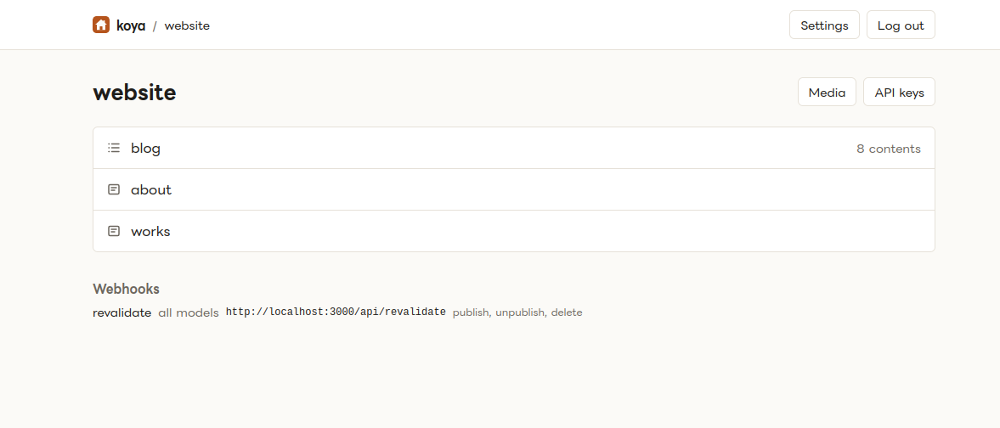
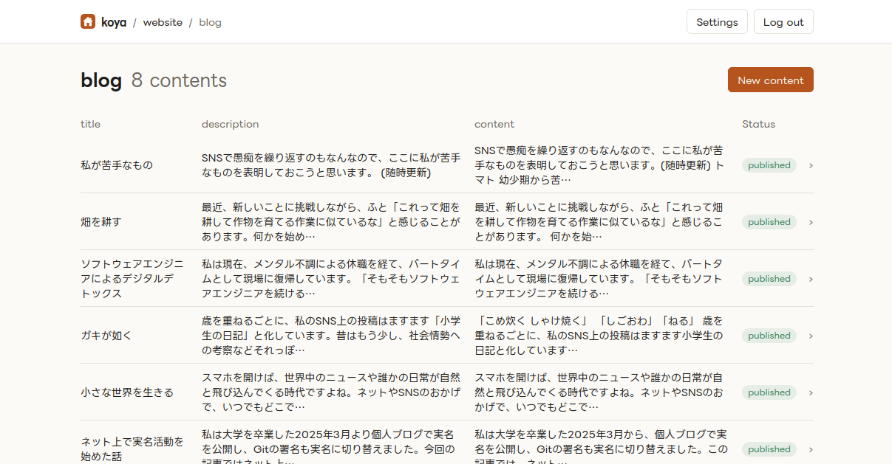

# koya

A small, self-hosted headless CMS written in Common Lisp, for one owner and any number of sites.

- **Server** (`koya-server`): admin UI (hsx + Tailwind, Quill for rich text), delivery API, admin API, media library, SQLite. One process, one Docker image.
- **Library** (`koya`): a schema DSL (`defspace` / `defmodel` / `webhook`), `plan` / `deploy` / `pull` to push that schema to the server, and an HTTP client for reading and managing content.

The schema is code in the site's repository; the server stores a copy and builds its editing forms from it. Design notes and the decision log live in [docs/DESIGN.md](docs/DESIGN.md).

## Admin UI

A space lists its models with their kind and content count, plus the webhooks that fire for them.



A list model shows a preview of every field and the status of each content; the whole row opens the editor.



The editor is generated from the model: text and textarea inputs, Quill for rich text, selects for references, a picker for media, with publish, unpublish, save-draft and discard-draft actions in a sticky bar.


Each space has a media library; images are uploaded here or straight from the editor and served by koya.


## Quick start (development)

```sh
just install          # Tailwind binary + qlot dependencies
cp .env.example .env  # set KOYA_SECRET; KOYA_PORT and KOYA_BASE_URL must agree
just build            # CSS
just dev              # serves on KOYA_PORT (default 3000)
```

Or from a REPL:

```lisp
(ql:quickload :koya-server)
(koya-server:start)   ; connects the DB, applies migrations, serves on KOYA_PORT
(koya-server:reload)  ; reload the code and restart
```

Log in at `/login` with `KOYA_SECRET`. Spaces and models appear once a schema has been deployed.

## Defining content models

In your own project (which depends on `koya`):

```lisp
(defspace website
  ;; fires for every model; events default to publish, unpublish and delete
  :webhooks (list (webhook "revalidate" "https://example.com/api/revalidate")))

(defmodel (website blog) (:kind :list
                          :public-url "https://example.com/blog/{CONTENT_ID}"
                          :preview-url "https://example.com/blog/{CONTENT_ID}?draft-key={DRAFT_KEY}"
                          ;; this model only, on draft saves as well
                          :webhooks (list (webhook "preview-build" "https://preview.example/hook" :events '(:draft))))
  (title    :text :required t)
  (slug     :slug :from title :unique t)
  (cover    :media)
  (content  :richtext)
  (tags     :reference :model tag :many t))

(defmodel (website tag) (:kind :list)
  (name :text :required t))

(defmodel (website about) (:kind :object)
  (body :richtext))
```

Field types: `:text` `:textarea` `:richtext` `:number` `:boolean` `:date` `:datetime` `:select` `:media` `:reference` `:slug`. Options such as `:required`, `:max-length`, `:pattern`, `:unique`, `:min`/`:max`, `:options` and `:many` are checked when the schema is built.

Then, from the REPL:

```lisp
(koya:configure :base-url "https://cms.example.com" :secret "..." :space "website")
(koya:plan)     ; show the diff against the server
(koya:deploy)   ; apply it (asks before destructive changes; :force t skips the question)
(koya:pull)     ; the schema currently on the server
```

Changes that can invalidate existing content (removing a field, changing a type, tightening a constraint) count as destructive.

## Reading content

```lisp
(koya:configure :api-key "koya_...")
(koya:get-list 'blog :query '(:limit 10 :orders "-publishedAt" :fields "id,title,publishedAt"))
(koya:get-list 'blog :query '(:include "tags"))   ; embed referenced contents (ids by default)
(koya:get-item 'blog "01J...")
(koya:get-object 'about)
```

The delivery API behind these calls:

```
GET /api/v1/{space}/{model}?limit=&offset=&orders=&fields=&filters=&include=&draftKey=
GET /api/v1/{space}/{model}/{id}
X-KOYA-API-KEY: koya_...
```

`filters` takes `field[op]value` terms joined with `[and]` / `[or]`; ops are `equals`, `not_equals`, `contains`, `not_contains`, `begins_with`, `exists`, `not_exists`, `less_than`, `greater_than`. References come back as ids unless named in `include` (`include=tags,author.avatar`); `:media` fields always expand to `{id, url, width, height, alt, ...}`. API keys are created per space on the space's **API keys** page.

## Webhooks

`(webhook label url :events (...))` with events from `:publish`, `:unpublish`, `:delete` and `:draft` (default: all but `:draft`). A space's webhooks fire for every model; a model's `:webhooks` add to them. Each call is a JSON POST `{service, api, id, type, contents: {old, new}}` with `type` one of `new`, `edit`, `delete`, `draft`, signed with the space's secret in `X-KOYA-WEBHOOK-KEY` (shown on the API keys page).

## Media

Images (PNG, JPEG, GIF, WebP, up to 20 MB) live in a per-space library under `KOYA_MEDIA_DIR` and are served by koya at `/media/{space}/{id}.{ext}`. Upload from the admin UI (`/s/{space}/media`, the picker on `:media` fields, or Quill's image button), or from Lisp:

```lisp
(koya:upload-media #p"cover.png" :alt "Cover")   ; => (:id "..." :url "https://cms.example.com/media/website/....png" ...)
(koya:list-media :search "cover")
(koya:delete-media "01J...")
```

## Two-factor login

Open **Settings** in the admin UI: scan the QR code with an authenticator app and confirm with a code. The login form then asks for the code as well as the secret. To keep the secret outside the database instead, `(koya-server:totp-setup)` prints a `KOYA_TOTP_SECRET` value; when that variable is set it takes precedence and the page is read-only.

## Tests

```sh
just test
```

## Deployment

The `Dockerfile` builds one image: Woo on port 3000, SQLite and media under `/data`. On Coolify, create a Dockerfile application from this repository and

- expose port `3000`;
- mount a persistent volume at `/data` (database and uploaded media; back this up);
- set the environment variables below.

| Variable | Required | Meaning |
|---|---|---|
| `KOYA_SECRET` | yes | owner secret for the admin UI and admin API |
| `KOYA_BASE_URL` | yes | public URL, e.g. `https://cms.example.com`; used for media URLs, the same-origin check and the Secure cookie flag |
| `KOYA_TOTP_SECRET` | no | second factor configured outside the database (see above) |
| `KOYA_PORT` | no | listen port, default `3000` |
| `KOYA_DB_PATH`, `KOYA_MEDIA_DIR` | no | default `/data/koya.db` and `/data/media` in the image |
| `KOYA_ENV` | no | `production` (default) masks error details; `dev` shows them |

Health check: `GET /health` (no auth; the image declares it as `HEALTHCHECK`). Migrations run at startup. Static assets are served with long immutable caching behind versioned URLs; API and page responses are `no-store`.
