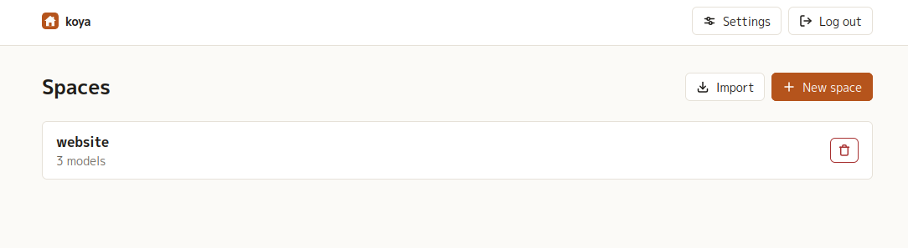
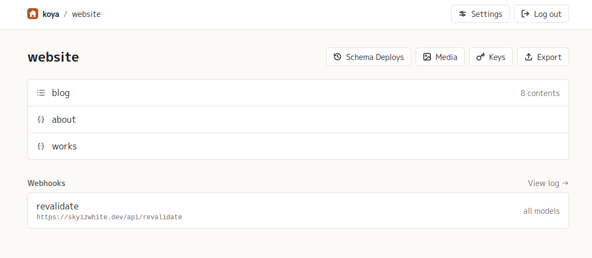
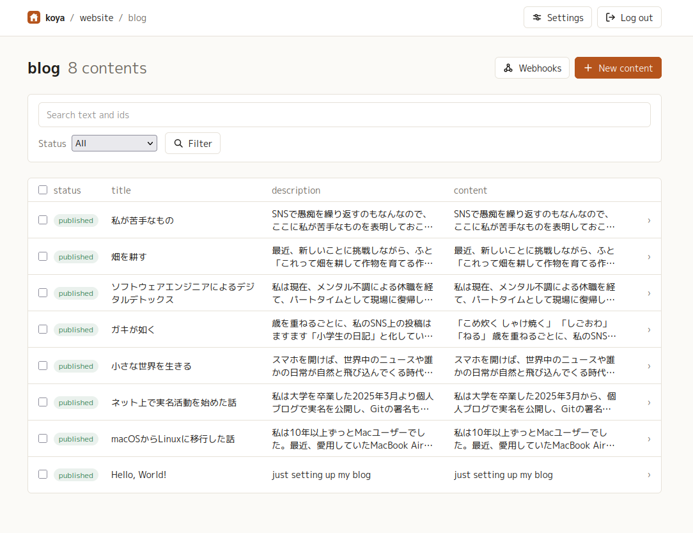
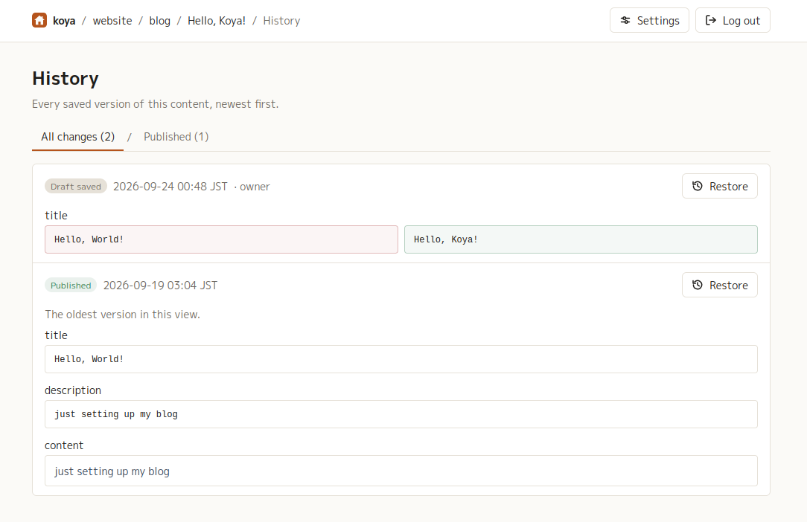
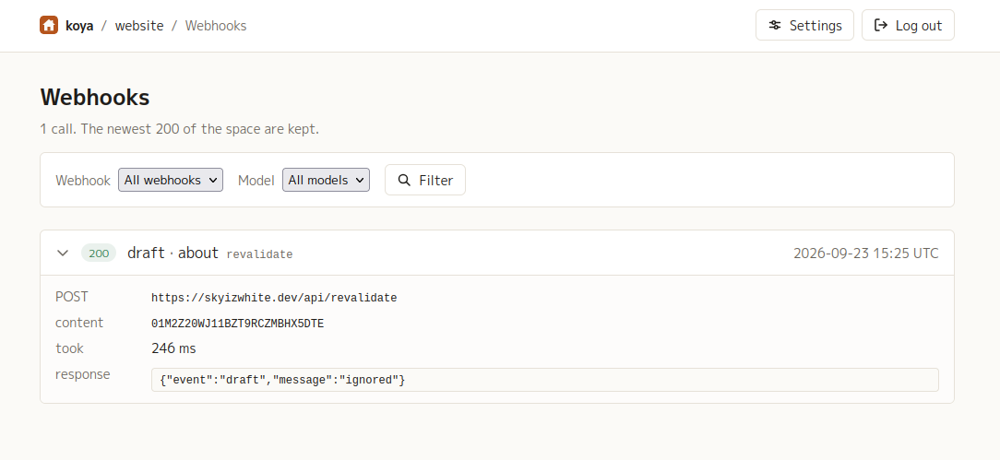
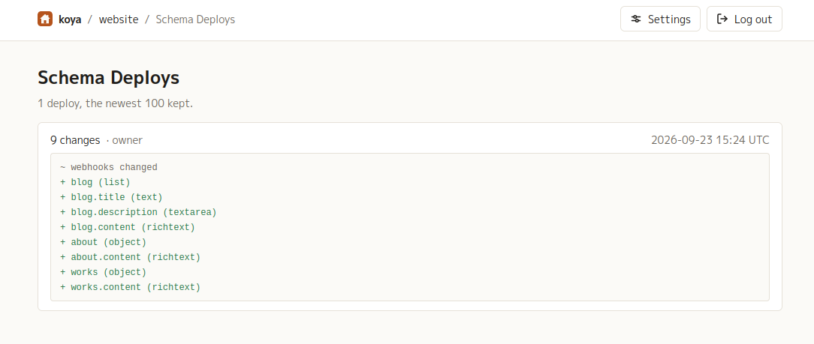
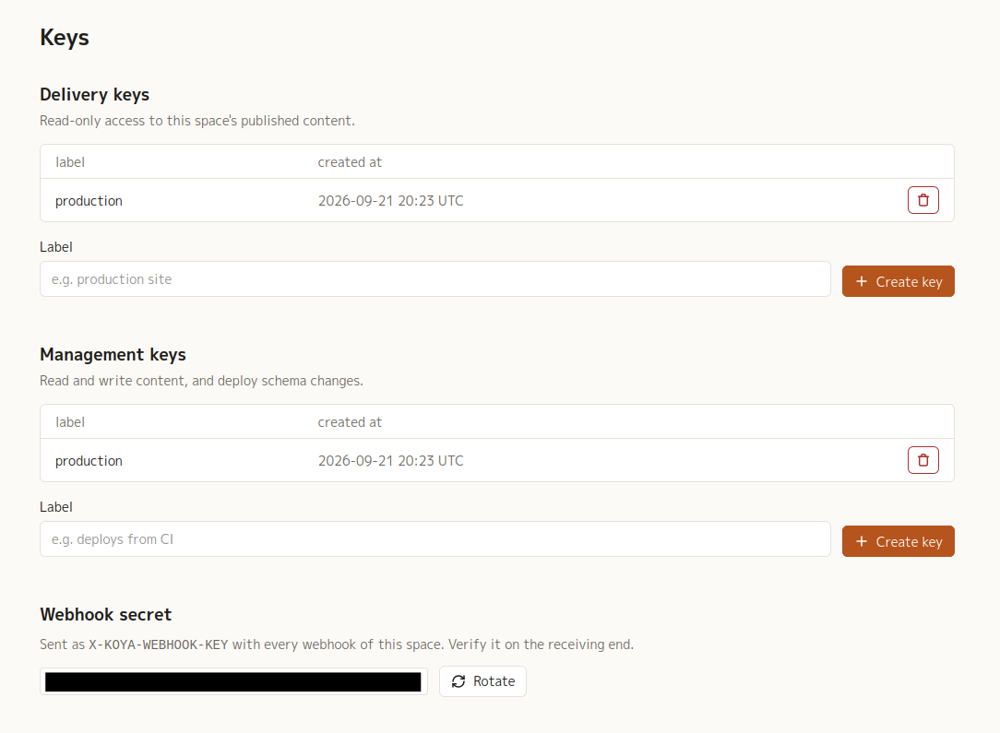
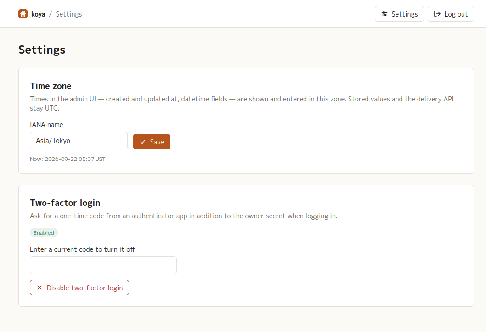

# The admin UI

koya's admin UI is the web app the server serves at its own root: one owner, any
number of spaces. It is where spaces are made, where content is written,
published and previewed, where images live, and where keys are made.

What it does **not** do is edit the schema. Models and fields are defined in a
site's own repository — `koya.config.ts` with
[koya-ts-sdk](https://github.com/skyizwhite/koya-ts-sdk) — and reach the server
with `koya deploy`. The admin UI reads that schema and
builds its lists and forms from it. **Spaces are the other way round**: a space
owns the contents, media and keys inside it, so it is made and deleted here, and
a deploy only ever changes the models of a space that already exists.

Every page, the login page included, ends with a footer: the running koya
version, a link to its source code and the AGPL notice. The server is under the
AGPL, which asks whoever runs a modified copy for others to offer them its
source; a fork keeps its footer honest by pointing the link at its own
repository (see [CONTRIBUTING.md](../CONTRIBUTING.md)).

- [Logging in](#logging-in)
- [Spaces](#spaces)
- [A space](#a-space)
- [Contents of a model](#contents-of-a-model)
- [The editor](#the-editor)
- [Drafts, publishing and previews](#drafts-publishing-and-previews)
- [History](#history)
- [The webhook delivery log](#the-webhook-delivery-log)
- [Schema deploys](#schema-deploys)
- [Media](#media)
- [Keys](#keys)
- [Settings: time zone and two-factor login](#settings-time-zone-and-two-factor-login)
- [Reference](#reference)

## Logging in

`GET /login` asks for the owner secret — the value of `KOYA_SECRET` — and, when
two-factor login is on, for the current code from an authenticator app. There are
no user accounts: whoever knows the secret is the owner.

- Five failed attempts from the same address within five minutes lock that
  address out for the rest of the window. The message never says which of the two
  factors was wrong.
- A session lasts 24 hours and is stored in the database, so a server restart or
  a redeploy does not log the owner out. The cookie is `HttpOnly`, `SameSite=Lax`
  and, when `KOYA_BASE_URL` is an `https://` URL, `Secure`.
- A page reached without a session sends the owner to `/login?next=…`, and
  logging in returns there. So does a button pressed on a page left open after
  the session ended: it comes back to that page, and what it sent is not
  replayed. `next` is followed only when it is a path on this server.
- Every page has **Log out** in the header; anything sent from another origin is
  rejected.
- The admin UI needs JavaScript. What is done on a page — saving, publishing,
  uploading, deleting, making a key — is sent with htmx and answered in place,
  so the page does not reload; moving between pages is ordinary navigation.
  Searching, filtering, sorting and paging a list are answered in place too, and
  the URL is replaced with them, so a reload, a bookmark or the back button from
  another page comes back to the list as it was left. The steps in between are
  not history entries of their own.
- The UI works down to a phone's width (375px): the page itself never scrolls
  sideways, though a wide table scrolls inside its own box. On a narrow screen
  the header's **Settings** and **Log out** are icons, its crumbs wrap, and the
  media library and picker dialogs fill the screen.

## Spaces

`/` lists the spaces with the number of models in each, and is where they are
made and deleted.

- **New space**, at the top right, opens a dialog asking for a name: lowercase
  letters, digits and hyphens (`^[a-z][a-z0-9-]*$`). The name is the space's id —
  it is in every admin URL and in the delivery API's `/api/v1/{space}/…` — so it
  cannot be changed afterwards. A name already taken, or one that is not a slug,
  is refused with the reason.
- A new space is empty: deploy a schema to it with `koya deploy` to give it
  models.
- **Delete** asks for confirmation and then removes the space with everything in
  it — models, contents, media rows and files, delivery keys, management keys and
  the webhook log. It cannot be undone.
- **Import**, beside **New space**, takes a zip made by a space's **Export** and
  makes that space again under its own name: its models and webhooks, every
  content with its draft, timestamps and history, its media, its delivery and
  management keys and its webhook secret, all as they were — the site's `.env`
  keeps working against the new instance. The name must be free, or the space
  must be empty: no models, media or keys (its webhooks and secret are
  replaced). Otherwise the import is refused and nothing changes. Nothing is
  sent to the webhooks. The schema it brings is in the space's deploy log.

## A space

`/s/{space}` lists the space's models in the schema's order — a list icon for a
`list` model, braces for an `object` model — with the number of contents in each
list model, and links to **Schema Deploys**, **Media** and **Keys**. A list model
opens its contents; an object model opens straight into its editor. **Export** downloads
the whole space as a zip for **Import** on the spaces page — `space.json` (the
schema, the contents with their drafts and history, the media rows) and the
media files under `media/`, the keys as their hashes, and the webhook secret.
Keep the file as privately as the database: it holds every draft and the secret.

Underneath, **Webhooks** shows every webhook of the space with its label, its URL
and what it covers — *all models*, or *`blog, tag` only* for one narrowed with
`only`. Every webhook receives every event (publish, unpublish, delete, draft)
for the models it covers; the payload says which. Webhooks are part of the
schema, so they are read-only here; change the schema's `webhooks` and deploy.

Each row opens the **delivery log** filtered to that webhook; *View log →*
beside the heading opens it unfiltered.

## Contents of a model

`/s/{space}/m/{model}` is a table: a status badge, then one column per field of
the model, then a chevron. Clicking anywhere in a row (or pressing Enter on it)
opens the editor. **Webhooks** in the header opens the space's delivery log
filtered to this model. An object model has no such page -- its link goes
straight to its one content -- so that button sits in its editor instead.

- Every field gets a preview, clamped to two lines: rich text is stripped to
  plain text, a datetime is shown as `YYYY-MM-DD HH:MM UTC`, a reference shows the
  referenced content's label (its model's `label` field, or its id), a `many` field shows its values comma-separated,
  a `media` field shows its image as a small thumbnail (the original file, loaded
  lazily; a media since deleted from the library shows `{id} (missing)`), and an
  empty field shows `—`. Column widths are bounded per field type, so a
  wide model scrolls sideways rather than squeezing every column thin.
- A row shows its **draft** data when it has one, so the table reflects what is
  being worked on rather than what is live.
- Contents are listed newest-created first, 20 to a page, with **Previous** /
  **Next** underneath when there are more. Every list in the admin UI shows 20.
- **New content** opens an empty editor at `/s/{space}/m/{model}/new`.

### Object models

An `object` model holds exactly one content — an about page, the site's
settings — so it has no list. Its URL goes straight to that content's editor,
or to a `new` one while it has none. The editor's heading is the model's name
alone, it carries the **Webhooks** button the list would have, and **Delete**
starts the content over.

### Finding one

A search box and a status filter above the table, and the column headers sort.
The search goes as the typing stops, and the status as it is picked; there is no
button. All three are put in the query string, so the list as you are reading it
is a link:

| | |
|---|---|
| `?q={text}` | matches the model's `text`, `textarea`, `slug` and `richtext` fields, and a whole content id |
| `?status={badge}` | `draft`, `published` or `published+draft` — the three badges the list shows |
| `?sort={field}` | ascending; `?sort=-{field}` descending. Any field of the model, and the system fields (`createdAt`, `updatedAt`, `publishedAt`, `revisedAt`, `id`) |

Clicking a header sorts by it, clicking the sorted one turns it around, and an
arrow marks it. The count beside the heading reads *3 of 120* while anything is
filtered; *Clear the search and filter*, above the table, drops both and keeps
the sort.

A search looks inside the data the list shows — the draft when there is one.
Rich text is searched as its stored HTML, so a query that reads like markup can
match a tag. The id is matched whole: ids made around the same time share a
prefix. A `?sort=` or `?status=` the model cannot have is ignored, so an old link
still opens the list, and a page past the end comes back to the last one.

### Doing it to several at once

A checkbox per row, one in the header for the page. Tick any and a bar appears
with **Publish**, **Unpublish** and **Delete**; Delete asks first. Filter first
and select the page: *status = draft*, select all, Publish.

Each content goes one at a time through the path a single one takes, so the
validation, the timestamps and the webhooks are the same, and a content another
refers to is refused here too. One that fails leaves the rest done — *Published
2 contents. 1 could not be: title is required* — and
one with nothing to do is left alone and counted, so republishing what is
published does not move its `revisedAt`, and unpublishing a draft does not
reissue its draft key: *Published 2 contents. 5 were already published.*

## The editor

`/s/{space}/m/{model}/{id}` generates a form from the model. Each field is
labelled with its name, its type and, when required, a red `*`. The breadcrumb
names the content by its model's `label` field, or by its id.

| Field type | Control |
|---|---|
| `text`, `slug` | text input — a blank `slug` is generated from its `from` field on save |
| `textarea` | five-row textarea |
| `richtext` | Quill editor; its image button opens the media picker |
| `number` | number input (any step) |
| `boolean` | checkbox — unchecked means `false`, never "unset"; a field with `default: true` starts checked on a new content |
| `date` | date input |
| `datetime` | datetime-local input, in the zone chosen under **Settings**; stored as UTC |
| `select` | dropdown, or checkboxes when `many` |
| `reference` | dropdown, or chips plus a dropdown when `many` |
| `media` | thumbnail with **Choose…** (opens the media picker) and **Clear** |

Notes on the generated controls:

- A reference dropdown lists up to 1000 contents of the target model, drafts
  included, labelled by the field the target model names as its `label` and
  otherwise by the id. An id that no longer resolves is kept and shown as
  `{id} (missing)`, so a save never drops it silently.
- Rich text is stored as HTML. Images inserted from the picker are stored as
  `/media/...` paths and made absolute again by the delivery API, so the HTML is
  safe to render on another site.
- A rich text field is written back only when it was edited. Quill rewrites HTML
  it did not write itself — it drops ids and `<figure>`s and adds `rel` to links
  — so HTML written through the API stays exactly as it is until someone changes
  it here, and saving another field does not show it as changed in the history.
- When validation fails the page comes back with a summary at the top and the
  message under each offending field; nothing is saved.

The sticky bar at the top of the editor carries the model's name and the
content's id, the status badge and the created/updated times, then — where the
content can be seen on the left, what can be done to it on the right:

| Button | What it does |
|---|---|
| **Preview draft** | opens the model's `previewUrl` with `{CONTENT_ID}` and `{DRAFT_KEY}` filled in — shown only while a draft with a key exists |
| **Published page** | opens the model's `publicUrl` — shown only while the content is published |
| **History** | the content's revisions, and where an old version is restored from — see [History](#history) |
| **Webhooks** | an object model's delivery log, where the list page would carry it — shown only while a webhook covers the model |
| **Discard draft** | throws the draft away and goes back to the published version (published contents only) |
| **Save draft** | saves the form as a draft, leaving what is published untouched |
| **Publish** | validates and publishes the form as it stands |

At the bottom, the **Danger zone** holds **Unpublish** (takes the content off the
delivery API, keeping its data as a draft) and **Delete** (removes it for good;
for an object model it starts the single content over). Both ask first. A
content that another content refers to through a `reference` field — in its
published data or its draft — can be neither: the page comes back saying how
many refer to it. Take it out of those contents first. Only the reference fields
in the current schema count, as for media.

## Drafts, publishing and previews

A content is in one of three states, shown as its badge:

| Status | Meaning |
|---|---|
| `draft` | never published, or unpublished; invisible to the delivery API |
| `published` | live, with no unpublished edits |
| `published+draft` | live, with newer draft edits alongside it |

- Saving a draft issues a **new draft key**, so previously shared preview links
  stop working.
- Publishing clears the draft, sets `revisedAt`, and keeps the original
  `publishedAt` on later publishes.
- Unpublishing keeps the data as a draft and clears `publishedAt`.
- Publishing, unpublishing and deleting fire the matching webhooks; saving a
  draft fires `draft` webhooks; discarding a draft fires none, since what is
  published did not change.

## History

Every write to a content is kept: each draft save, publish, unpublish and
discard, with who made it (the owner, or a management key by its label) and
when. A draft save that changes nothing is not kept. Nothing is ever pruned;
deleting the content deletes its history with it.

`/s/{space}/m/{model}/{id}/history` — **History** in the editor — shows it newest
first, 20 to a page, in two views, each tab counting its revisions:

| View | Shows | Each one compared with |
|---|---|---|
| **All changes** | every revision | the revision before it |
| **Published** | the versions that were live | the version published before it |

Each revision is badged by what it was — *Draft saved*, *Published*,
*Unpublished* or *Draft discarded* — with when and by whom, and drawn as the
fields it changed, the old value on the left and the new one on the right. The
oldest one in the view has nothing before it, so it shows every field it had,
as *The oldest version in this view*. Rich text is shown formatted, in a
sandboxed frame where nothing in it can run; references and media carry their
label or file name while they still exist.

**Restore** opens the editor with that version in the form, under a banner
saying which version it is. Nothing is stored until **Save draft** or
**Publish** — restoring never touches what is live by itself, and **Cancel**
goes back to the current data.

The schema and the space may have changed since the version was written, so
not everything always comes back. The banner lists each field that did not:

| Case | What happens |
|---|---|
| the field has been removed from the model | left out |
| the value no longer fits the field — its type or options changed, it became required, a unique value is now taken by another content | the field keeps its current value |
| a reference to a content that has since been deleted, unpublished, or is only a draft | that reference is dropped |
| a media that has since been deleted from the library, or re-uploaded (a new upload is a new id) | that media is dropped |

A deleted content cannot be restored at all: its history went with it. A field
renamed with `was` is renamed in the history too, so its old values restore
into it.

## The webhook delivery log

`/s/{space}/webhooks` is the last 200 calls the space made, newest first, 20 to
a page; **View log →** on the space page opens it. A row names the webhook's
label and the model, and carries the outcome as a badge:

| Badge | Meaning |
|---|---|
| a 2xx status, green | the receiver accepted the call |
| any other status, red | it answered, and refused |
| *no response*, amber | the call never arrived: DNS, a refused connection, a timeout |

Opening a row shows the event, the URL it posted to, a link to the content that changed,
how long the call took, the error when there was one, and **the response body**
as the receiver sent it — the first 4000 characters of it, which is where a
revalidation hook's own error message usually is.

There is one log per space, and the narrower views are the same page filtered:

| Filter | Shows | Linked from |
|---|---|---|
| `?label={label}` | one webhook's calls | a webhook row on the space page |
| `?model={model}` | every call a change to that model set off | *Webhooks* on the model's page, or in an object model's editor |

Both together narrow to one webhook's calls for one model. Two selects above
the list both show what is filtered and are how it is set, so a filter can be
set on the page as well as arrived at by link: picking one applies it, and
*Clear the filters* drops both. They offer every model of the space
and every webhook of it, whether or not it has fired yet, plus
anything the log still holds that the schema no longer does.

Nothing here is retried, and nothing is kept beyond the newest 200 calls of a
space: this is a log to glance at after a publish, not an audit trail.

## Schema deploys

`/s/{space}/deploys` is what each deploy of this space's schema changed, newest
first, 20 to a page. **Schema Deploys** on the space page opens it.

Each entry says how many changes it carried, whether any was destructive, who
deployed it — `(management key: deploys from CI)`, or `owner` — and when. Under
that is the diff, one line per change, as `koya plan` prints it:

| Line | Meaning |
|---|---|
| `+ blog.title (text)` | something new, in green |
| `- blog.summary (text)` | something gone, in red |
| `~ blog.title renamed from heading` | a rename, in the accent colour |
| `~ blog options changed (publicUrl none -> "https://…")` | a change, with what moved |
| `! ~ blog.title options tightened (maxLength 100 -> 50)` | a change that can reject content already stored |

A `!` marks a change that can hide or invalidate stored content — the ones a
deploy refuses without `force` — and the line is red whatever its marker.

Only the changes are kept, not the schema as it was; read that from the space
page or with `koya pull`. A deploy that changed nothing leaves no entry, and
the newest 100 of a space are kept.

## Media

`/s/{space}/media` is the space's image library.

Each card has a checkbox and **Select all** sits above the grid. With a
selection, **Delete** appears and asks first. A file some
content still uses is refused as it is singly; the rest of the selection goes,
and the message says how many could not and why.

- **Upload** takes PNG, JPEG, GIF and WebP, several at once, up to 20 MB each.
  The type is decided by reading the file's leading bytes, not by what the browser
  claims. Files are stored under `KOYA_MEDIA_DIR/{space}/` and served at
  `/media/{space}/{id}.{ext}` with a long immutable cache.
- The grid is thumbnails only, 20 per page, with paging underneath. The search box
  matches file names as the typing stops; `?q=` and `?page=` carry both.
- Clicking a thumbnail opens a preview dialog with the file's name, dimensions,
  size and upload time, an **alt text** box to save, and **Delete**. A file that
  any content still uses — as a `media` value or inside rich text — cannot be
  deleted: its button is disabled and says how many contents use it, and the
  server refuses too. Take it out of those contents first. Only the fields in
  the current schema count: a value left behind in a field a deploy removed
  does not keep a file.
- The same library opens as a picker inside the editor — from a `media` field's
  **Choose…** button and from Quill's image button. The picker searches and
  uploads too, so an image can go straight from the desktop into a content.

## Keys

koya has four kinds of key, each for one job:

| Key | Made where | Used for |
|---|---|---|
| owner secret | `KOYA_SECRET` in the environment | logging into this UI |
| management key | a space's **Keys** page | the admin API for that space (schema deploys, content and media management from a site's code) |
| delivery key | the same page | reading that space through the delivery API |
| webhook secret | one per space, on the same page | signing the webhooks koya sends |

Everything but the owner secret belongs to one space, so `/s/{space}/keys` holds
all of it.

- **Delivery keys** are what a site sends as `X-KOYA-DELIVERY-KEY` to read this
  space's published content. Safe to put where a front end can reach it.
- **Management keys** are what `koya deploy` and the admin API calls
  send as `Authorization: Bearer …`. A key reaches this space and nothing else —
  sent to another space's route it is refused with 403 — and it cannot log into
  this UI, just as the owner secret cannot call the admin API.
- **Create key** takes an optional label and shows the key (`koya_…` or
  `koya_mgmt_…`) once. Only its SHA-256 is stored, so a lost key cannot be
  recovered — delete it and make another. Deleting a key stops whatever used it.
- The **Webhook secret** section shows the value koya sends as the
  `X-KOYA-WEBHOOK-KEY` header with every webhook of the space, and can rotate it.
  Verify it on the receiving end.

## Settings: time zone and two-factor login

`/settings` holds what applies to the whole server rather than to one space.
Keys are not here: they belong to a space, and are made on its **Keys** page.

**Time zone** is the zone every page shows times in — created and updated at,
the list previews, and `datetime` fields, which are also entered in it. Type an
IANA name (`Asia/Tokyo`, `Europe/Berlin`; the box offers the zones the server
knows) and save; the line underneath shows the current time in it as a check.
The default is UTC. Storage and the delivery API are not affected: they stay UTC.

**Two-factor login** turns the second factor on: **Set up two-factor login** shows a QR
code, the Base32 secret and the `otpauth://` URI; scanning it and entering a
current code stores the secret and starts asking for a code at login. The secret
is only kept once the app has proved it has it.

Disabling asks for a current code as well. A code can only be used once. With
the authenticator lost, stop the server and delete the secret from the database
on the volume — `sqlite3 /data/koya.db "DELETE FROM settings WHERE key = 'totp_secret'"`
— and the owner secret alone logs in again.

## Reference

### URLs

| Path | Page |
|---|---|
| `/` | spaces: the list, and where they are made and deleted |
| `/login` | log in |
| `/settings` | instance settings (time zone, two-factor login) |
| `/s/{space}` | a space: models and webhooks |
| `/s/{space}/export` | the space as a zip |
| `/s/{space}/deploys` | what each schema deploy changed |
| `/s/{space}/webhooks` | the webhook delivery log; `?label=` and `?model=` narrow it |
| `/s/{space}/m/{model}` | contents of a model; `?q=`, `?status=` and `?sort=` narrow and order it (object models redirect to their content) |
| `/s/{space}/m/{model}/{id}` | the editor; `new` for a new content; `?revision=` fills it with an old version |
| `/s/{space}/m/{model}/{id}/history` | the content's history; `?view=published` for the published versions alone |
| `/s/{space}/media` | media library |
| `/s/{space}/keys` | delivery keys, management keys and the webhook secret |
| `/health` | unauthenticated health check (verifies the database answers) |
| `/actions/…` | what the pages' buttons and forms send, answered in place; htmx requests only |

### Limits worth knowing

| Thing | Value |
|---|---|
| Rows per page: contents, media, deliveries, deploys, revisions | 20 |
| Contents offered in a reference field | 1000 |
| Media per picker page | 24 |
| Webhook deliveries kept | the newest 200 per space |
| Schema deploys kept | the newest 100 per space |
| Response body stored per delivery | 4000 characters |
| Upload size and types | 20 MB; PNG, JPEG, GIF, WebP |
| Session lifetime | 24 hours, stored in the database |
| Login lockout | 5 failures per address per 5 minutes |

### What the UI deliberately leaves out

- Editing the schema: the models of a space belong to the site's repository (see
  [SCHEMA.md](SCHEMA.md)). Making and deleting the space itself does belong here.
- User accounts and roles: there is one owner.
- History over the APIs: revisions are read and restored in the admin UI only.

For the reasoning behind these, see [the decision records](../adr).
