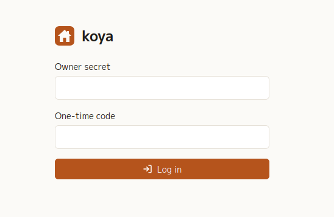

# The admin UI

koya's admin UI is the web app the server serves at its own root: one owner, any
number of spaces. It is where spaces are made, where content is written,
published and previewed, where images live, and where keys are made.

What it does **not** do is edit the schema. Models and fields are defined in a
site's own repository — `koya.config.ts` with
[koya-ts-sdk](https://github.com/skyizwhite/koya-ts-sdk) — and reach the server
with `koya deploy`. The admin UI reads that schema and builds its lists and
forms from it. **Spaces are the other way round**: a space owns the contents,
media and keys inside it, so it is made and deleted here, and a deploy only ever
changes the models of a space that already exists.

Every page ends with a footer showing the running koya version and a link to its
source code.

- [Logging in](#logging-in)
- [Spaces](#spaces)
- [A space](#a-space)
- [Contents of a model](#contents-of-a-model)
- [The editor](#the-editor)
- [Drafts, publishing and previews](#drafts-publishing-and-previews)
- [History](#history)
- [The webhook delivery log](#the-webhook-delivery-log)
- [Schema deploys](#schema-deploys)
- [Media](#media)
- [Keys](#keys)
- [Settings: time zone and two-factor login](#settings-time-zone-and-two-factor-login)
- [What the UI leaves out](#what-the-ui-leaves-out)

## Logging in

The login page asks for the **owner secret** — the `KOYA_SECRET` the server was
started with — and, when two-factor login is on, for the current **one-time
code** from an authenticator app. There are no user accounts: whoever knows the
secret is the owner.

- Too many failed attempts in a row lock that address out for a few minutes. The
  message never says which of the two was wrong.
- A session lasts a day and survives a server restart or a redeploy.
- A page opened without a session goes to the login page and comes back to that
  page after logging in. So does a button pressed on a page left open after the
  session ended: it comes back to the page, and what it sent is not replayed.
- **Log out** is in the header of every page.
- The result of what is done on a page shows briefly at the top of the screen.
- The UI works on a phone as well.

## Spaces

The first page lists the spaces with the number of models in each, and is where
they are made and deleted.

- **New space**, at the top right, asks for a name: lowercase letters, digits and
  hyphens. The name is the space's id — it is in every admin URL and in the
  delivery API — so it cannot be changed afterwards. A name already taken is
  refused.
- A new space is empty: deploy a schema to it with `koya deploy` to give it
  models.
- **Delete** asks for confirmation and then removes the space with everything in
  it — models, contents, media, keys and the webhook log. It cannot be undone.
- **Import**, beside **New space**, takes a zip made by a space's **Export** and
  makes that space again under its own name with everything as it was: its
  models and webhooks, every content with its draft and history, its media, its
  keys and its webhook secret. A site's `.env` keeps working against the new
  instance. The name must be free, or the space must be empty; otherwise the
  import is refused and nothing changes. Nothing is sent to the webhooks. A bar
  shows the upload; the server then makes the space in one step and answers
  nothing else until it is done.

## A space

A space's page lists its models in the schema's order — a list icon for a `list`
model, braces for an `object` model — with the number of contents in each list
model, and links to **Schema Deploys**, **Media** and **Keys**. A list model
opens its contents; an object model opens straight into its editor.

**Export** downloads the whole space as a zip for **Import** on the spaces page.
Keep the file as privately as the database: it holds every draft and the space's
secrets.

Underneath, **Webhooks** shows every webhook of the space with its label, its URL
and the models it covers — *all models*, or a few named ones. Webhooks are part
of the schema, so they are read-only here; change the schema's `webhooks` and
deploy. Each row opens the [delivery log](#the-webhook-delivery-log) filtered to
that webhook; *View log →* beside the heading opens it unfiltered.

## Contents of a model

A list model's page is a table: a status badge, then one column per field of the
model. Clicking anywhere in a row opens the editor. **Webhooks** in the header
opens the delivery log filtered to this model.

- Every field gets a short preview: rich text as plain text, a reference as the
  referenced content's label, a media as a small thumbnail, a `many` field as its
  values comma-separated, an empty field as `—`.
- A row shows its **draft** when it has one, so the table reflects what is being
  worked on rather than what is live.
- Contents are listed newest first, 20 to a page, with **Previous** / **Next**
  underneath when there are more.
- **New content** opens an empty editor.

### Object models

An `object` model holds exactly one content — an about page, the site's
settings — so it has no list. Its link goes straight to that content's editor,
or to a new one while it has none. The editor carries the **Webhooks** button
the list would have, and **Delete** starts the content over.

### Finding one

A search box and a status filter sit above the table, and the column headers
sort. The search goes as the typing stops and the status as it is picked; there
is no button.

- The search matches the model's text fields — `text`, `textarea`, `slug` and
  `richtext` — and a whole content id. It looks at what the table shows: the
  draft, when there is one.
- The status filter offers the three badges: `draft`, `published` and
  `published+draft`.
- Clicking a header sorts by it, clicking the sorted one turns it around, and an
  arrow marks it. The system fields (created, updated, published, revised, id)
  can be sorted by as well.

The count beside the heading reads *3 of 120* while anything is filtered.
*Clear the search and filter*, above the table, drops both and keeps the sort.
All three are in the URL, so the list as you are reading it is a link.

### Doing it to several at once

A checkbox per row, and one in the header for the whole page. Tick any and a
bar appears with **Publish**, **Unpublish** and **Delete**; Delete asks first.
Filter first and select the page: *status = draft*, select all, Publish.

Each content goes through the same path a single one takes, so validation and
webhooks are the same, and a content another refers to is refused here too. One
that fails leaves the rest done, and the message says how many could not and
why — *Published 2 contents. 1 could not be: title is required*. One with
nothing to do is left alone and counted — *Published 2 contents. 5 were already
published.*

## The editor

The editor is a form generated from the model. Each field is labelled with its
name, its type and, when required, a red `*`. The breadcrumb names the content
by its model's `label` field, or by its id.

| Field type | Control |
|---|---|
| `text`, `slug` | text input — a blank `slug` is generated from its `from` field on save |
| `textarea` | multi-line text |
| `richtext` | a rich text editor; its image button opens the media picker |
| `number` | number input |
| `boolean` | checkbox — unchecked means `false`; a field with `default: true` starts checked on a new content |
| `date` | date picker |
| `datetime` | date and time picker, in the time zone chosen under **Settings** |
| `select` | dropdown, or checkboxes when `many` |
| `reference` | dropdown, or chips plus a dropdown when `many` |
| `media` | thumbnail with **Choose…** (opens the media picker) and **Clear** |

- A reference dropdown lists every content of the target model, drafts included,
  by its label. A reference to a content that no longer exists is kept and shown
  as *(missing)*, so a save never drops it silently.
- When validation fails the page comes back with a summary at the top and the
  message under each offending field; nothing is saved.

The sticky bar at the top of the editor carries the model's name and the
content's id, the status badge and the created/updated times, then — where the
content can be seen on the left, what can be done to it on the right:

| Button | What it does |
|---|---|
| **Preview draft** | opens the model's preview URL for this draft — shown when the schema gives the model a `previewUrl` and a draft exists |
| **Published page** | opens the content on the site — shown when the schema gives the model a `publicUrl` and the content is published |
| **History** | the content's revisions, and where an old version is restored from — see [History](#history) |
| **Webhooks** | an object model's delivery log — shown while a webhook covers the model |
| **Discard draft** | throws the draft away and goes back to the published version |
| **Save draft** | saves the form as a draft, leaving what is published untouched — on only while the form holds a change |
| **Publish** | validates and publishes the form as it stands |

At the bottom, the **Danger zone** holds **Unpublish** (takes the content off the
delivery API, keeping its data as a draft) and **Delete** (removes it for good;
for an object model it starts the single content over). Both ask first. A
content that another content refers to through a `reference` field — in its
published data or its draft — can be neither: the page comes back saying how
many refer to it. Take it out of those contents first.

## Drafts, publishing and previews

A content is in one of three states, shown as its badge:

| Status | Meaning |
|---|---|
| `draft` | never published, or unpublished; invisible to the delivery API |
| `published` | live, with no unpublished edits |
| `published+draft` | live, with newer draft edits alongside it |

- Saving a draft makes a **new preview link**; previously shared preview links
  stop working.
- Publishing clears the draft and updates the revised time. The original
  published time stays through later publishes.
- Unpublishing keeps the data as a draft.
- Publishing, unpublishing, deleting and saving a draft each notify the
  webhooks that cover the model. Discarding a draft does not, since what is
  published did not change.

## History

Every write to a content is kept — each draft save, publish, unpublish and
discard — with who made it (the owner, or a management key by its label) and
when. A save that changes nothing makes no entry, so every entry has a change to
show. Nothing is ever pruned; deleting the content deletes its history with it.

**History** in the editor shows it newest first, 20 to a page, in two views:

| View | Shows | Each one compared with |
|---|---|---|
| **All changes** | every revision | the revision before it |
| **Published** | the versions that were live | the version published before it |

Each revision is badged by what it was — *Draft saved*, *Published*,
*Unpublished* or *Draft discarded* — with when and by whom, and drawn as the
fields it changed, the old value on the left and the new one on the right. The
oldest one in the view shows every field it had. Rich text is shown formatted;
references and media carry their label or file name while they still exist.

**Restore** opens the editor with that version in the form, under a banner
saying which version it is. Nothing is stored until **Save draft** or
**Publish** — restoring never touches what is live by itself, and **Cancel**
goes back to the current data.

The schema and the space may have changed since the version was written, so not
everything always comes back. The banner lists each field that did not: a field
since removed from the model is left out, a value that no longer fits the field
leaves the current value in place, and a reference or media that has since been
deleted is dropped. A deleted content cannot be restored at all: its history
went with it.

## The webhook delivery log

The delivery log is the last 200 calls the space's webhooks made, newest first;
**View log →** on the space page opens it. A row names the webhook and the
model, and carries the outcome as a badge:

| Badge | Meaning |
|---|---|
| a 2xx status, green | the receiver accepted the call |
| any other status, red | it answered, and refused |
| *no response*, amber | the call never arrived: DNS, a refused connection, a timeout |

Opening a row shows the event, the URL it posted to, a link to the content that
changed, how long the call took, the error when there was one, and the start of
**the response body** as the receiver sent it — which is where a revalidation
hook's own error message usually is.

Two selects above the list narrow it to one webhook, to one model, or to both.
The same views are reached by link: a webhook row on the space page opens that
webhook's calls, and **Webhooks** on a model's page opens the calls a change to
that model set off. *Clear the filters* drops both.

Nothing here is retried, and nothing is kept beyond the newest 200 calls of a
space: this is a log to glance at after a publish, not an audit trail.

## Schema deploys

**Schema Deploys** on the space page shows what each deploy of the space's
schema changed, newest first.

Each entry says how many changes it carried, whether any was destructive, who
deployed it — the owner, or a management key by its label — and when. Under that
is the diff, one line per change, as `koya plan` prints it:

| Line | Meaning |
|---|---|
| `+ blog.title (text)` | something new, in green |
| `- blog.summary (text)` | something gone, in red |
| `~ blog.title renamed from heading` | a rename |
| `~ blog options changed (publicUrl none -> "https://…")` | a change, with what moved |
| `! ~ blog.title options tightened (maxLength 100 -> 50)` | a change that can reject content already stored |

A `!` marks a change that can hide or invalidate stored content — the ones a
deploy refuses without `force`.

Only the changes are kept, not the schema as it was; read that from the space
page or with `koya pull`. A deploy that changed nothing leaves no entry, and the
newest 100 of a space are kept.

## Media

**Media** on the space page opens the space's image library.

- **Upload** takes PNG, JPEG, GIF and WebP, several at once, up to 20 MB each
  and 20 MB in one go.
- The grid is thumbnails, newest first, with paging underneath. The search box
  matches file names as the typing stops.
- Clicking a thumbnail opens a preview with the file's name, dimensions, size
  and upload time, an **alt text** box to save, and **Delete**.
- A file that any content still uses — as a `media` value or inside rich text —
  cannot be deleted: the button says how many contents use it. Take it out of
  those contents first.
- Each card has a checkbox, and **Select all** sits above the grid. With a
  selection, **Delete** appears and asks first. A file still in use is skipped,
  the rest go, and the message says how many could not and why.

The same library opens as a picker inside the editor — from a `media` field's
**Choose…** button and from the rich text editor's image button. The picker
searches, scrolls through the library and uploads too, so an image can go
straight from the desktop into a content.

## Keys

koya has four kinds of key, each for one job:

| Key | Made where | Used for |
|---|---|---|
| owner secret | `KOYA_SECRET`, where the server runs | logging into this UI |
| management key | a space's **Keys** page | `koya deploy` and the admin API for that space |
| delivery key | the same page | reading that space's published content through the delivery API |
| webhook secret | one per space, on the same page | signing the webhooks koya sends |

Everything but the owner secret belongs to one space, so the space's **Keys**
page holds all of it.

- **Delivery keys** are what a site uses to read this space's published content.
  Safe to put where a front end can reach it.
- **Management keys** are what `koya deploy` and the admin API use. A key reaches
  this space and nothing else, and it cannot log into this UI, just as the owner
  secret cannot call the admin API.
- **Create key** takes an optional label and shows the key once. A lost key
  cannot be recovered: delete it and make another. Deleting a key stops whatever
  used it.
- The **Webhook secret** is sent with every webhook of the space so the receiver
  can check the call came from koya, and can be rotated here.

How a site sends each key is in [API.md](API.md).

## Settings: time zone and two-factor login

**Settings** in the header holds what applies to the whole server rather than
to one space. Keys are not here: they belong to a space, and are made on its
**Keys** page.

**Time zone** is the zone every page shows times in — created and updated at,
the list previews, and `datetime` fields, which are also entered in it. Type an
IANA name (`Asia/Tokyo`, `Europe/Berlin`; the box offers the zones the server
knows) and save; the line underneath shows the current time in it as a check.
The default is UTC. What the delivery API returns is not affected: it stays UTC.

**Two-factor login** adds a one-time code to the login page. **Set up two-factor
login** shows a QR code to scan with an authenticator app; entering a current
code turns it on. Turning it off asks for a current code as well.

With the authenticator lost, stop the server and delete the secret from the
database on the volume — `sqlite3 /data/koya.db "DELETE FROM settings WHERE key
= 'totp_secret'"` — and the owner secret alone logs in again.

## What the UI leaves out

- Editing the schema: the models of a space belong to the site's repository (see
  [SCHEMA.md](SCHEMA.md)). Making and deleting the space itself does belong here.
- User accounts and roles: there is one owner.
- History over the APIs: revisions are read and restored in the admin UI only.

For the reasoning behind these, see [the decision records](../adr).
